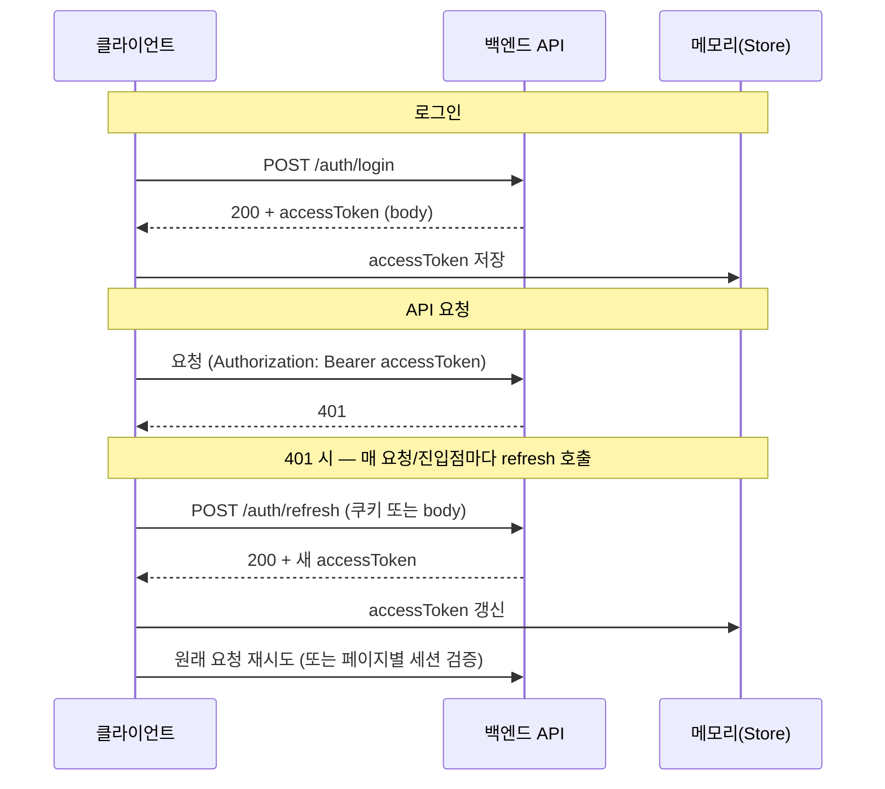
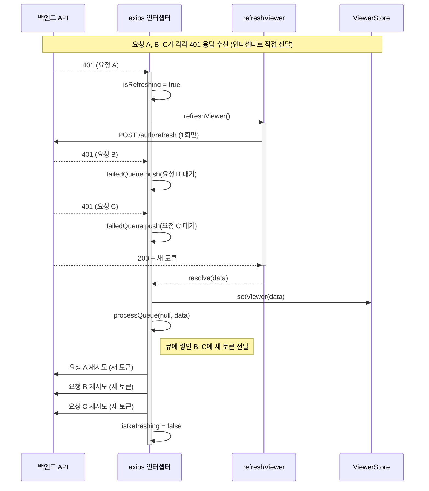
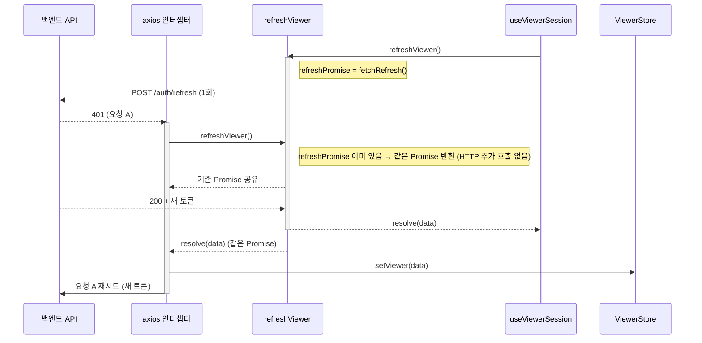
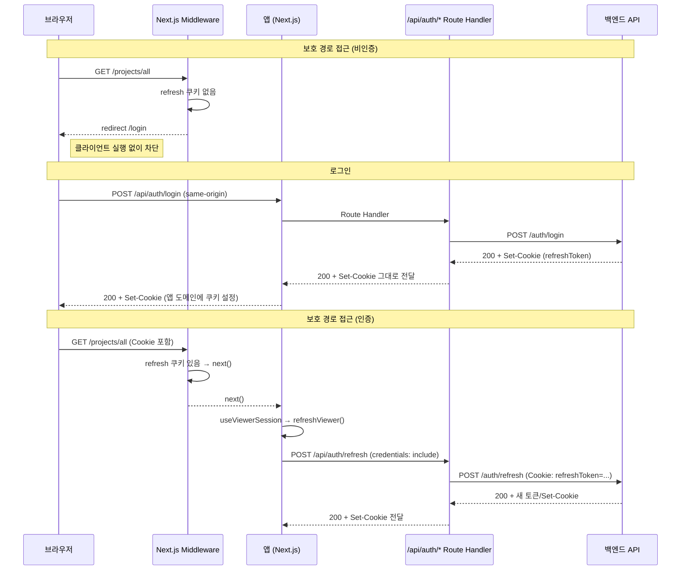

# 인증 개선 과정

클라이언트 전용 인증에서 시작해 **싱글톤 + Refresh Queue** 도입, 이어서 **쿠키 기반 인증을 Proxy Handler + Middleware**로 확장한 전반적인 개선 과정을 정리한다.

---

## Phase 1: 기존 상태 (클라이언트 전용, 싱글톤/큐 없음)

### 흐름

- 로그인 성공 시 **accessToken만 메모리(Store)**에 저장, API 요청 시 `Authorization` 헤더로 전달.
- 401 발생 시 **각 요청·각 진입점(세션 검증 등)**에서 **각각** refresh를 호출.
- 보호 구간 접근 제어는 **클라이언트에서만** 처리(라우트 진입 후 검증 → 리다이렉트).

### 문제점

| 문제 | 설명 |
|------|------|
| **refresh 중복 호출** | 401이 동시에 여러 건 발생하면 refresh가 여러 번 호출됨. 네트워크/서버 부하 증가, 토큰 불일치·레이스 가능성. |
| **다중 진입점에서 중복** | 세션 검증(페이지 진입)과 401 인터셉터가 동시에 refresh를 호출하면, 동일 시점에 refresh 요청이 2회 이상 나갈 수 있음. |
| **1차 차단 없음** | 비인증 사용자도 보호 경로로 요청이 들어와 **클라이언트 번들 실행·렌더링 후** 리다이렉트됨. 불필요한 JS 실행과 화면 깜빡임 발생. |
| **쿠키·도메인 이슈** | refresh token을 HTTP-only 쿠키로 쓸 때, 앱 도메인과 API 도메인이 다르면 클라이언트에서 직접 API를 호출하는 refresh 요청에 쿠키가 붙지 않을 수 있음. |

### 해결 방향

- Phase 2: **싱글톤 Promise + Refresh Queue**로 refresh 호출을 1회로 통합.
- Phase 3: **Proxy Handler + Middleware**로 쿠키 기반 인증을 앱 도메인에 맞추고, 서버 측 1차 접근 제어 추가.

---

## Phase 2: 싱글톤 Promise + Refresh Queue 도입

### 흐름 1: 여러 요청(A, B, C)이 동시에 401을 받는 경우

- 첫 401(요청 A)만 `refreshViewer()`를 호출하고 **실제 HTTP 1회**만 발생. 요청 B, C는 **failedQueue**에 넣어 대기.
- refresh 완료 시 **processQueue**로 B, C에게도 새 토큰을 전달한 뒤, A·B·C 모두 새 토큰으로 재시도.

### 흐름 2: 세션 검증 + 401이 동시에 refresh를 부르는 경우

- **refreshViewer**: 진행 중인 refresh가 있으면 **새 HTTP 요청 없이** 기존 Promise만 반환 (싱글톤 Promise).
- **인터셉터**: 401 수신 시 `isRefreshing` 플래그로 **한 번만** refresh 실행, 나머지 401은 **failedQueue**에 넣었다가 refresh 완료 후 새 토큰으로 일괄 재시도.

### Phase 1 대비 해결된 점

| 항목 | 결과 |
|------|------|
| **401 다중 발생** | refresh **1회만** 호출, 나머지는 큐에서 대기 후 재시도. 네트워크/서버 부하 감소, 토큰 일관성 확보. |
| **세션 검증 + 401 동시 발생** | 두 진입점이 **같은 Promise**를 공유하므로 실제 `/auth/refresh` 호출은 1회. 중복 호출 제거. |

### 성능·안정성

- 동시 401 N건 → refresh 1회 + N건 재시도.
- 세션 검증과 401이 겹쳐도 refresh 1회로 수렴.

### Phase 2에서 남은 문제 (Phase 3에서 해결)

- 보호/게스트 라우트에 대한 **서버 측 1차 차단** 없음 → 비인증 사용자도 클라이언트까지 도달.
- refresh token이 **앱 도메인 쿠키**가 아니면, 클라이언트가 직접 API 도메인으로 refresh 호출 시 쿠키 미전송 가능 → **Proxy 경유 필요**.

---

## Phase 3: 쿠키 기반 인증 + Proxy Handler + Middleware

### 흐름

- **로그인/회원가입/refresh/로그아웃**: 모두 **앱 도메인**의 `/api/auth/*` Route Handler를 거쳐 백엔드 호출. Set-Cookie는 앱 도메인 기준으로 전달.
- **Middleware**: 요청 단계에서 **refresh 쿠키 유무**만 보고 보호 경로 → 비인증 시 `/login`, 게스트 경로 + 인증 시 `/projects/all`로 리다이렉트.
- **클라이언트**: 보호 라우트에서만 `useViewerSession` → `refreshViewer()`(프록시 호출), 게스트는 `useGuestAuthGuard`로 스토어만 확인(불필요한 refresh 호출 없음).

### Phase 2 대비 해결된 점

| 항목 | 결과 |
|------|------|
| **1차 접근 제어** | 비인증 사용자의 보호 경로 접근 시 **Middleware에서 즉시** `/login`으로 리다이렉트. 클라이언트 번들 실행·렌더링 없이 차단. |
| **쿠키 도메인 통일** | 인증 API를 앱 도메인 프록시로만 호출 → refresh token이 **앱 도메인 쿠키**로 설정되어, Middleware·refresh 호출이 일관되게 동작. |
| **순환 리다이렉트 방지** | refresh 실패(4xx 등) 시 Route Handler가 응답에서 **쿠키 삭제**를 설정. 이후 `/login`으로 가도 Middleware가 쿠키 없음으로 인식해 무한 리다이렉트가 발생하지 않음. |
| **게스트 라우트 최적화** | 게스트 경로에서는 `refreshViewer()`를 호출하지 않고 스토어만 확인. 이중 세션 검증 제거. |

### 결과 및 성능

- **체감 성능**: 비인증 사용자는 보호 경로에서 **즉시** `/login`으로 이동. 불필요한 JS 실행·렌더링 감소.
- **안정성**: Phase 2의 싱글톤·Refresh Queue 유지. 동시 401·다중 진입점에서도 refresh 1회.
- **일관성**: 로그인/회원가입/refresh/로그아웃이 모두 같은 프록시·쿠키 정책을 사용해 인증 플로우가 단순하고 예측 가능함.

---

## 참고: 유저 동작별 시나리오 (최종 상태)

| 유저 동작 | 1차: 미들웨어 | 2차: 클라이언트 | 결과 |
|-----------|----------------|------------------|------|
| 비로그인 + 보호 경로 접근 | refresh 쿠키 없음 → `/login` 리다이렉트 | 실행 안 됨 | 로그인 페이지로 이동 |
| 비로그인 + 게스트 경로 접근 | 쿠키 없음 → `next()` | `useGuestAuthGuard`: 스토어만 확인 | 로그인/회원가입 화면 |
| 로그인 시도 | — | `POST /api/auth/login` (프록시) | 쿠키 설정 + 스토어 갱신 → `/projects/all` |
| 로그인 후 보호 경로 접근 | 쿠키 있음 → `next()` | `useViewerSession` → `refreshViewer()` | 세션 검증 후 페이지 표시 |
| 로그인 상태 + 게스트 경로 접근 | 쿠키 있음 → `/projects/all` 리다이렉트 | 실행 안 됨 | 메인으로 이동 |
| API 호출 중 401 | — | 인터셉터: `refreshViewer()` 1회, 큐 대기 후 재시도 | 새 토큰으로 재요청 또는 로그아웃 |
| 로그아웃 | — | `POST /api/auth/logout` (프록시) + 쿠키 삭제 | 스토어 초기화 → `/login` |

---

## 참고: 백엔드 전제 (최종 상태)

- **쿠키 이름**: refresh token 쿠키 이름 `refreshToken` (프론트 `REFRESH_COOKIE_NAME`과 동일).
- **Set-Cookie Domain**: 생략하거나 앱 도메인으로 설정. 생략 시 응답을 주는 호스트(앱의 Route Handler) 기준으로 쿠키가 설정됨.

---

## 참고: 싱글톤 vs Refresh Queue 역할 요약

| 구분 | 담당 | 역할 |
|------|------|------|
| **Singleton Promise** | refreshViewer | 여러 진입점(세션 검증, 401 인터셉터)이 동시에 호출해도 **실제 `/auth/refresh` 호출은 1회**, 동일 Promise 공유. |
| **Refresh Queue** | 인터셉터 | 401이 여러 건이어도 **refresh 실행은 1회**, 나머지는 큐에 넣었다가 완료 시 새 토큰으로 각자 재시도. |
