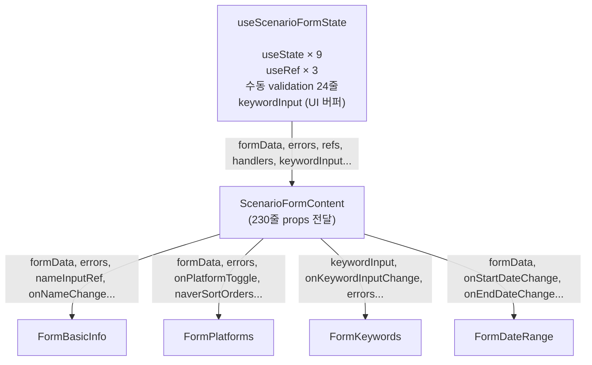
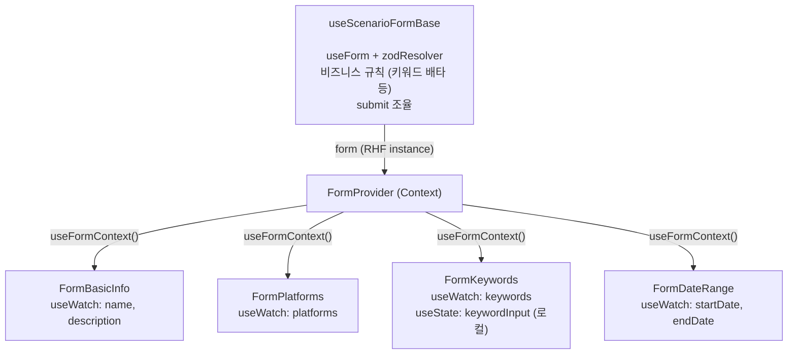
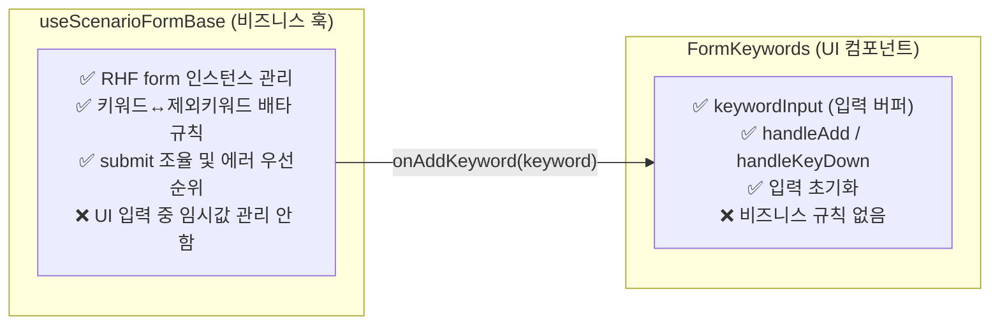
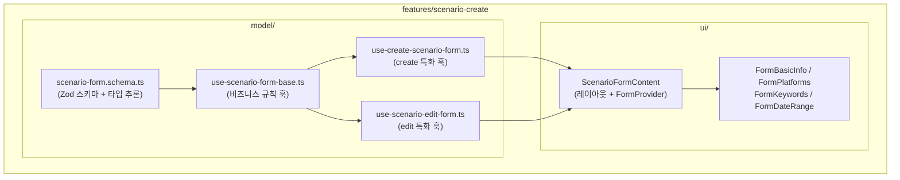
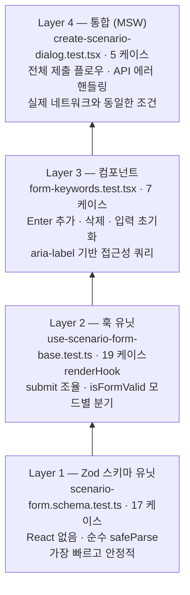

## React Hook Form + Zod 도입: 시나리오 폼 아키텍처 리팩터링

---

### Summary

| 지표 | Before | After | 개선 |
|---|---|---|---|
| 핵심 파일 순 코드량 | 592줄 | 358줄 | **234줄 감소** |
| 훅 내 `useState` / `useRef` | 9개 / 3개 | 0개 / 0개 | **100% 제거** |
| 시나리오 폼 테스트 케이스 | 24개 | 60개 | **+150%** |
| `scenario-form-content.tsx` | 230줄 | 77줄 | **-67%** |

---

### Problem

시나리오 생성/수정 폼이 성장하면서 단일 커스텀 훅(`use-scenario-form-state.ts`)이 세 가지 책임을 동시에 떠안게 되었습니다.

**1. 비대해진 로컬 상태 — `useState` 9개 + `useRef` 3개가 훅 한 곳에 집중**

```typescript
// ❌ Before: use-scenario-form-state.ts (592줄)
const nameInputRef    = useRef<HTMLInputElement>(null);
const galleryInputRef = useRef<HTMLInputElement>(null);
const authorInputRef  = useRef<HTMLInputElement>(null);

const [errors,                 setErrors]                = useState<IScenarioFormErrors>({});
const [formData,               setFormData]              = useState<IScenarioFormState>(DEFAULT_FORM_STATE);
const [keywordInput,           setKeywordInput]          = useState("");
const [excludeKeywordInput,    setExcludeKeywordInput]   = useState("");
const [authorInput,            setAuthorInput]           = useState("");
const [boardInput,             setBoardInput]            = useState("");
const [boardSearchQuery,       setBoardSearchQuery]      = useState("");
const [showBoardResults,       setShowBoardResults]      = useState(false);
const [showAuthorBoardResults, setShowAuthorBoardResults]= useState(false);
```

**2. 명령형 validation — submit 시 if-else 분기 24줄이 훅에 산재**

```typescript
// ❌ Before: submit 함수 내 수동 검증
const newErrors: IScenarioFormErrors = {};

if (!formData.name.trim()) {
  newErrors.name = true;
  setErrors(newErrors);
  toast.error("시나리오명을 입력해주세요");
  nameInputRef.current?.focus();
  return;
}
if (formData.platforms.length === 0) {
  newErrors.platforms = true;
  setErrors(newErrors);
  toast.error("최소 1개 플랫폼을 선택해주세요");
  return;
}
if (formData.keywords.length === 0) { ... }
if (!formData.startDate) { ... }
// ↑ 필드가 늘어날수록 if-else도 비례해서 증가
```

**3. 과도한 props drilling — 모든 상태와 핸들러가 하위 컴포넌트까지 전파**

```typescript
// ❌ Before: scenario-form-content.tsx (230줄)
<FormBasicInfo
  formData={form.formData}
  errors={form.errors}
  nameInputRef={form.nameInputRef}
  onNameChange={(name) => {
    form.setFormData((prev) => ({ ...prev, name }));
    if (form.errors.name && name.trim())
      form.setErrors((prev) => ({ ...prev, name: false }));
  }}
  onDescriptionChange={(description) => {
    form.setFormData((prev) => ({ ...prev, description }));
  }}
  nameDisabled={disabled.nameDisabled}
  descriptionDisabled={disabled.descriptionDisabled}
/>
<FormPlatforms
  platforms={form.formData.platforms}
  platformsList={form.PLATFORMS}
  errors={form.errors}
  onPlatformToggle={form.handlePlatformToggle}
  naverPlatformSortOrders={form.formData.naverPlatformSortOrders}
  onNaverSortOrderChange={form.handleNaverSortOrderChange}
  disabled={disabled.restDisabled}
/>
// ... FormKeywords, FormDateRange 모두 동일한 패턴
```

---

### Investigation

**렌더링 범위 문제 — 제어 컴포넌트 vs 비제어 컴포넌트**

기존 방식은 `useState`로 모든 입력값을 관리하는 **제어 컴포넌트(Controlled)** 였습니다. 키 입력 한 번마다 `setFormData`가 호출되고, 이 상태를 구독하는 컴포넌트 트리 전체가 리렌더됩니다.

RHF는 내부적으로 `useRef`로 DOM 입력값을 직접 관리하는 **비제어 컴포넌트(Uncontrolled)** 방식을 기반으로 합니다. React 렌더 사이클을 거치지 않고 입력값을 추적하므로, 구독하지 않은 컴포넌트는 리렌더되지 않습니다. 여기에 `useWatch({ name: "..." })`를 각 컴포넌트 내부에서 직접 호출하면 해당 컴포넌트만 리렌더 범위로 한정됩니다.

이 차이는 단순한 숫자 최적화가 아니라 **저사양 디바이스나 느린 환경에서 타이핑 시 발생하는 입력 지연(Input Lag)을 방지**합니다. 폼 필드가 많아질수록 복잡한 렌더 트리를 매 입력마다 재계산하는 비용이 누적되고, 이것이 실제 UX에서 체감되는 응답 지연으로 이어지기 때문입니다.

**타입 안전성 문제**

`IScenarioFormErrors { name?: boolean, platforms?: boolean }` 방식은 "에러 유/무"만 표현할 수 있고 에러 메시지 문자열은 별도 toast 호출로 관리해야 했습니다. Zod 스키마는 `z.infer<typeof schema>`로 폼 값 타입을 자동 추론하고, field별 에러 메시지를 구조화된 형태로 제공합니다.

**Zod 선택 근거**

Yup, Joi 등 대안과 비교했을 때 Zod를 선택한 이유는 다음 세 가지입니다.

- **TypeScript-first 설계**: 별도 타입 정의 없이 `z.infer<typeof schema>`로 폼 값 타입이 자동 추론됩니다. Yup은 스키마와 타입을 따로 관리해야 합니다.
- **superRefine**: 복수 필드 간 관계(날짜 역전, 배타 규칙 등)를 `ctx.addIssue({ path: ["endDate"] })`로 특정 필드에 귀속시킬 수 있습니다. 이 API가 없었다면 복합 검증을 훅 레벨에서 직접 처리해야 했습니다.
- **`@hookform/resolvers` 공식 지원**: RHF와의 연결에 별도 어댑터 코드가 필요 없습니다.

**UI 버퍼 상태의 위치**

`keywordInput`(입력 중인 임시값)은 폼의 최종 제출 데이터가 아닙니다. 이것이 훅에 있으면 "비즈니스 규칙을 집행하는 훅"이 "UI 입력 중 상태"까지 책임지는 SRP 위반이 됩니다.

---

### Architecture: Before vs After

**Before — 단일 훅이 모든 것을 소유**



**After — RHF Context가 상태 채널이 되고, 훅은 비즈니스 규칙만 집행**



핵심 차이: 상태 채널이 `props`에서 `Context`로 바뀌면서 `ScenarioFormContent`는 레이아웃 조립과 `FormProvider` 제공 역할만 남았습니다.

> **`useFormContext` 트레이드오프**: 이 컴포넌트들은 "시나리오 폼"이라는 특정 도메인에 종속된 feature 단위 컴포넌트입니다. 범용 재사용보다 도메인 응집도를 우선하는 FSD 원칙에 따라, Context 공유로 얻는 생산성(props 제거)이 재사용성 제약보다 합리적이라고 판단했습니다.

---

### Solution: Zod 스키마 분리

validation 로직을 훅에서 꺼내 독립적인 선언형 스키마(`scenario-form.schema.ts`)로 분리했습니다.

```typescript
// ✅ After: scenario-form.schema.ts
export const createScenarioFormSchema = z
  .object({
    name: z.string()
      .min(1, "시나리오명을 입력해주세요")
      .max(SCENARIO_NAME_MAX_LENGTH, `시나리오명은 ${SCENARIO_NAME_MAX_LENGTH}자 이내로 입력해주세요`),
    platforms: z.array(z.enum(PLATFORM_KEYS)).min(1, "최소 1개 플랫폼을 선택해주세요"),
    keywords: z.array(z.string().max(KEYWORD_ITEM_MAX_LENGTH))
      .min(1, "키워드는 1개 이상 입력해주세요")
      .refine((kws) => new Set(kws).size === kws.length, "키워드는 중복되지 않아야 합니다"),
    startDate: z.date().nullable(),
    endDate:   z.date().nullable(),
    isOngoing: z.boolean(),
    // ...
  })
  .superRefine((data, ctx) => {
    // 단일 필드 검증으로 표현 불가한 복합 규칙: 날짜 교차 검증
    if (!data.startDate) {
      ctx.addIssue({ code: "custom", path: ["startDate"], message: "시작일을 선택해주세요" });
      return;
    }
    if (!data.isOngoing && data.endDate && data.endDate < data.startDate) {
      ctx.addIssue({ code: "custom", path: ["endDate"], message: "종료일은 시작일 이후여야 합니다" });
    }
  });

export type TCreateScenarioFormValues = z.infer<typeof createScenarioFormSchema>;
//                                      ↑ 폼 값 타입을 스키마에서 자동 추론
```

`superRefine`을 사용한 이유: "시작일 ≤ 종료일", "미래 날짜 불가" 같은 규칙은 단일 필드 스키마로 표현할 수 없고 복수 필드 간 관계를 봐야 합니다. `ctx.addIssue({ path: ["endDate"] })`로 에러를 특정 필드에 귀속시키므로 RHF의 `formState.errors.endDate`로 그대로 접근 가능합니다.

---

### Design Philosophy: SRP 기반 상태 소유권 분리



`keywordInput`을 컴포넌트 로컬 `useState`로 이동한 근거: 이 값은 "Enter를 누르기 전 임시 입력값"으로, 폼 최종 데이터와 생명주기가 다릅니다. 훅에 두면 비즈니스 훅이 UI 임시 상태까지 책임지는 SRP 위반이 되고, `keywordInput` 변경마다 훅 전체 리렌더가 발생하는 성능 문제도 생깁니다.

---

### FSD 레이어 구조와의 관계



스키마를 `model/` 아래 별도 파일로 분리한 이유: 스키마는 훅과 달리 React에 의존하지 않는 순수 데이터 계약입니다. 훅과 테스트 모두에서 독립적으로 import할 수 있고, 이 덕분에 "스키마 유닛 테스트 → 훅 유닛 테스트 → 컴포넌트 테스트 → 통합 테스트"의 4-layer 테스트 전략을 자연스럽게 구성할 수 있었습니다.

---

### Test Strategy: 4-Layer



Layer 1을 별도로 분리한 이유: 스키마는 React 없이 순수 함수처럼 테스트할 수 있습니다. 모든 validation 경계 조건(날짜 역전, 중복 키워드, null 처리 등)을 상위 레이어보다 빠르고 저비용으로 검증할 수 있어, 상위 레이어 테스트에서 "validation이 올바른가"를 다시 검증할 필요가 없습니다.

**엣지 케이스 테스트 예시** — 날짜 역전, 미래 날짜, `isOngoing` 조건 분기를 `superRefine`이 올바르게 처리하는지 path까지 검증:

```typescript
it("endDate가 startDate보다 이른 날짜면 실패한다", () => {
  const result = createScenarioFormSchema.safeParse({
    ...validBase,
    isOngoing: false,
    startDate: new Date(2025, 0, 10),
    endDate:   new Date(2025, 0, 5),  // 역전
  });
  expect(result.success).toBe(false);
});

it("startDate가 내일 날짜면 실패한다", () => {
  const tomorrow = new Date();
  tomorrow.setDate(tomorrow.getDate() + 1);
  const result = createScenarioFormSchema.safeParse({ ...validBase, startDate: tomorrow });
  expect(result.success).toBe(false);
});

it("isOngoing=true면 endDate가 null이어도 통과한다", () => {
  const result = createScenarioFormSchema.safeParse({ ...validBase, isOngoing: true, endDate: null });
  expect(result.success).toBe(true);  // 진행 중 시나리오는 종료일 불필요
});
```

---

### Result & Impact

**코드량**

| 파일 | Before | After | 변화 |
|---|---|---|---|
| `use-scenario-form-state.ts` | 592줄 | `use-scenario-form-base.ts` 470줄 | **-122줄 (-21%)** |
| `scenario-form-content.tsx` | 230줄 | 77줄 | **-153줄 (-67%)** |
| 전체 변경 (커밋 `586f3be`) | — | 727줄 추가 / 961줄 삭제 | **순 234줄 감소** |

**상태 관리**

| 항목 | Before | After |
|---|---|---|
| 훅 내 `useState` | 9개 | 0개 |
| 훅 내 `useRef` | 3개 | 0개 |
| 수동 validation 분기문 | ~24줄 | 0줄 |
| 에러 타입 | `boolean` 플래그 | Zod field별 메시지 문자열 |

**렌더링 범위**

제어 컴포넌트(`useState` 기반) → 비제어 컴포넌트(RHF `useRef` 기반) + `useWatch` 필드 단위 구독으로 전환. 폼 필드가 많아질수록 타이핑 시 리렌더 범위가 전체 트리 → 해당 컴포넌트 하나로 한정되어, 저사양 환경에서도 입력 지연 없는 반응성을 유지합니다.

**테스트**

| 항목 | Before | After |
|---|---|---|
| 시나리오 폼 테스트 파일 | 3개 | 6개 |
| 시나리오 폼 테스트 케이스 | 24개 | 60개 **(+150%)** |
| 커버 레이어 | 훅 유닛, payload 변환 | 스키마 유닛 / 훅 / 컴포넌트 / 통합(MSW) |

**Evidence:** 커밋 [`586f3be`](https://github.com/Harvester-LALA/lala-frontend/commit/586f3be4c80d2f4648c082bdcd4b8f14ca823988) (리팩터링) · 커밋 [`a5ef155`](https://github.com/Harvester-LALA/lala-frontend/commit/a5ef155) (테스트)
